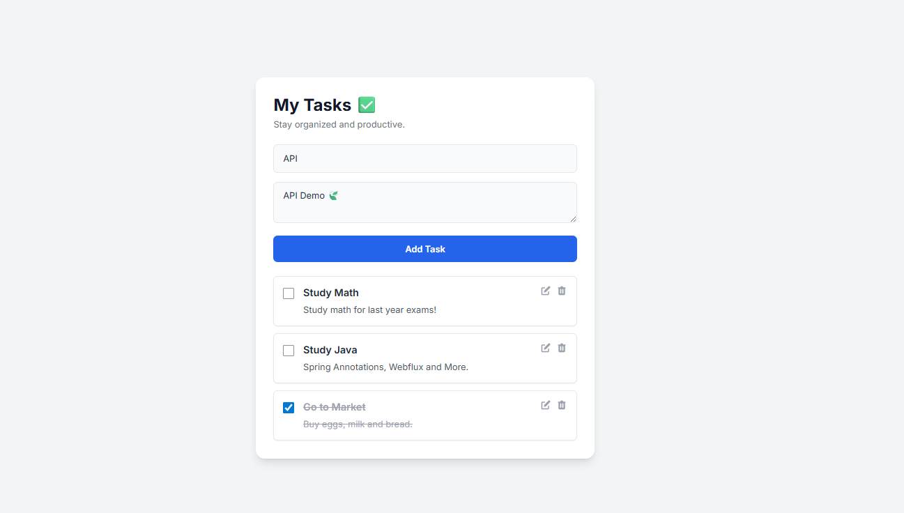

# Fullstack Todo-List with Spring

A fullstack to-do list application built with Spring Boot and HTML/CSS/JS. The goal of this project was to apply fullstack web development concepts by building a robust RESTful API and an interactive frontend.

## Features

* **Create, Read, Update, and Delete (CRUD)** operations for tasks.
* Use of DTO-Pattern.
* Mark tasks as **completed** or **pending**.
* Filter tasks by status (all, pending, completed).
* **Responsive design** that adapts to desktops and mobile devices.

## 🛠️ Tech Stack

* **Backend:**
    * Java 17+
    * Spring Boot
    * Spring Data JPA
    * Spring Web
    * Maven
* **Frontend:**
    * HTML5 & CSS3
    * JavaScript
* **Database:**
    * H2 and Postgres (Might add later with Docker 🐋)
